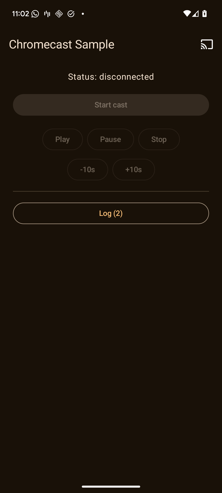
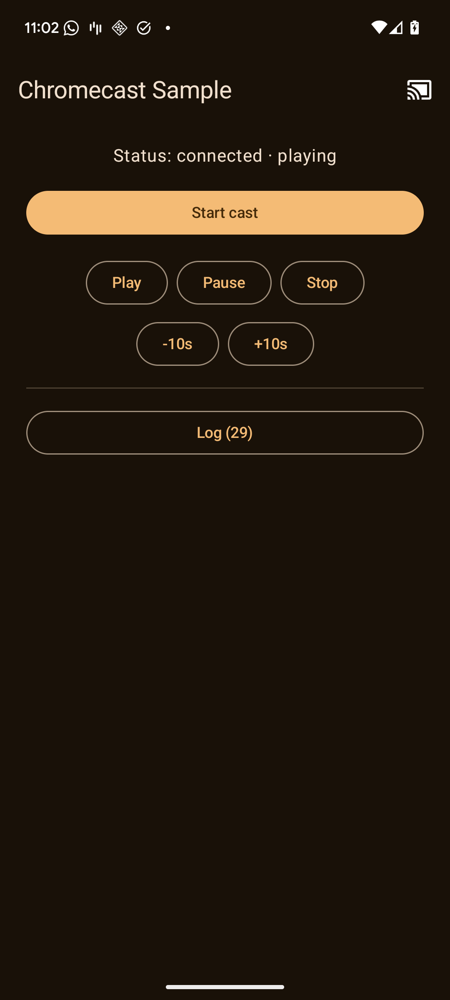
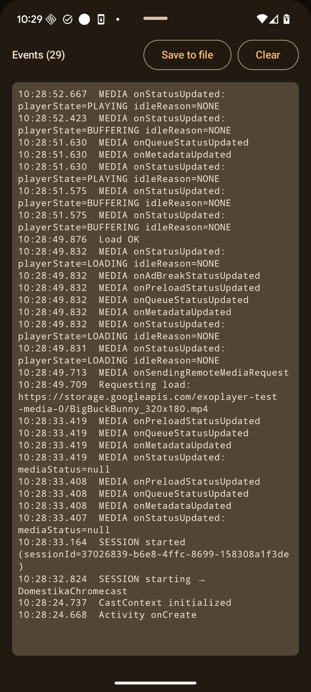

# ChromecastSample

Android sample app demonstrating Google Cast SDK integration with Jetpack Compose. Discovers Chromecast devices on the local network, casts a sample video, and exposes playback controls plus a full diagnostic event log that can be exported to a file.

| Idle | Playing | Event log |
|:---:|:---:|:---:|
|  |  |  |

## Overview

The app is intentionally small — one Activity, one screen — and exists to demonstrate the moving parts of a Cast sender integration:

- Device discovery via `MediaRouteButton` in the top bar (`NEARBY_WIFI_DEVICES` requested on first tap on API 33+).
- Session management via `SessionManagerListener<CastSession>`.
- Media loading via `RemoteMediaClient.load(MediaLoadRequestData)`.
- Playback control (play / pause / stop / ±10s seek) via `RemoteMediaClient`.
- Full diagnostic surface: every SDK callback is logged both in-app and to `logcat`, and the in-app log can be exported to a `.txt` for sharing.

## Cast SDK Integration

The Cast plumbing lives in `MainActivity.kt` and `cast/CastOptionsProvider.kt`:

- **`CastOptionsProvider`** implements `OptionsProvider` and returns `CastOptions` with the default media receiver app ID (`CC1AD845`). Registered via `<meta-data>` on `<application>` in `AndroidManifest.xml`.
- **`CastContext.getSharedInstance(this)`** is called synchronously in `onCreate()`, so `sessionManager` is available before the first `onResume()` runs and its `addSessionManagerListener(...)` call actually attaches.
- **`SessionManagerListener<CastSession>`** logs every lifecycle callback (starting / started / start-failed / resuming / resumed / resume-failed / ending / ended / suspended) with human-readable status codes via `CastStatusCodes.getStatusCodeString()`.
- **`RemoteMediaClient.Callback`** is registered on session start and logs status transitions (`playerState`, `idleReason`) plus receiver-side media errors.
- **`MediaRouteButton`** is hosted in Compose via an `AndroidView` wrapper, themed with an AppCompat `ContextThemeWrapper` because the chooser dialog reads AppCompat theme attributes.

## Playback Controls

Row 1 (transport):

- **Play / Pause / Stop** → `RemoteMediaClient.play() / pause() / stop()`.

Row 2 (jog):

- **-10s / +10s** → `RemoteMediaClient.seek(MediaSeekOptions)` relative to `approximateStreamPosition`, clamped to 0.

Every playback request logs both the request itself and its `MediaChannelResult` (success or `CastStatusCodes` name + status message), so silent receiver rejections stay visible.

## Debugging

- **In-app event log** — every SDK callback and request result is appended to a `SnapshotStateList` capped at 200 entries and rendered in a scrollable monospace panel behind a **Log (N)** button on the main screen.
- **File export** — the **Save to file** action inside the log sheet opens the system Storage Access Framework save dialog (`ActivityResultContracts.CreateDocument("text/plain")`) and writes the log chronologically (oldest first) as `HH:mm:ss.SSS  <message>`.
- **logcat** — every event is also mirrored to `Log.d("ChromecastSample", ...)`:
  ```
  adb logcat -s ChromecastSample:D
  ```

## Technology Stack

| Component | Version | Purpose |
|-----------|---------|---------|
| **Language** | Kotlin 2.2.10 | |
| **UI** | Jetpack Compose + Material3 (BOM 2024.09.00) | Declarative UI, `ModalBottomSheet` for the log |
| **Activity base** | `androidx.fragment.app.FragmentActivity` | Required by `MediaRouteButton`'s chooser `DialogFragment` |
| **Cast SDK** | `com.google.android.gms:play-services-cast-framework:21.5.0` | Chromecast discovery + media control |
| **AppCompat** | `androidx.appcompat:appcompat:1.7.0` | Provides the AppCompat theme attributes MediaRouter reads |
| **Min / Target SDK** | 28 / 35 | Android 9 / 15 |
| **AGP** | 9.1.1 | |

## Requirements

- A Play-enabled Android device or emulator (Cast needs Google Play Services).
- A Chromecast on the same Wi-Fi network as the device.
- Local network reachability between the device and the Chromecast (some corporate Wi-Fi networks block mDNS discovery and will prevent devices from appearing in the chooser).

## Configuration Notes

- The sample video URL is defined in `MainActivity.kt` as `SAMPLE_VIDEO_URL` and points at `storage.googleapis.com/exoplayer-test-media-0/BigBuckBunny_320x180.mp4` (Google's ExoPlayer test bucket). The older `commondatastorage.googleapis.com/gtv-videos-bucket/sample/BigBuckBunny.mp4` returns HTTP 403 today.
- On Android 13+ the app requests `NEARBY_WIFI_DEVICES` (with `usesPermissionFlags="neverForLocation"`) on the first tap of the cast icon. The chooser opens regardless of grant / deny.
